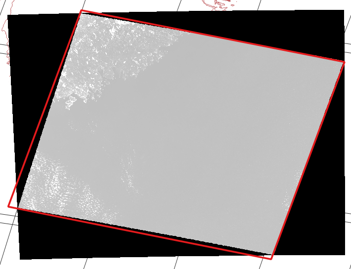

# sat-stac-landsat

This is a repository used for the creation and maintenance of a [STAC](https://github.com/radiantearth/stac-spec) compliant [Landsat catalog](https://landsat-stac.s3.amazonaws.com/catalog.json) for data from the [Landsat on AWS project](https://registry.opendata.aws/landsat-8/) (located at s3://landsat-pds/).

There are two pieces of this repository:

- A Python library (satstac.landsat) and CLI containing functions for reading Landsat metadata, transforming to STAC Items, and adding to the Landsat catalog.
- An AWS Lambda handler that accepts an SNS message containing the s3 URL for a new Landsat scene, transforms it, and adds it to the Landsat catalog.

To create the Landsat STAC catalog located at https://landsat-stac.s3.amazonaws.com/catalog.json the sat-stac-landsat CLI was used to create the initial catalog of historical data. The Lambda function is deployed and keeping the catalog up to date with new scenes.


## Usage

A command line tool is available for ingesting the existing Landsat data and creating/adding to a STAC catalog.

```bash
$ sat-stac-landsat ingest -h
usage: sat-stac-landsat ingest [-h] [--version] [--log LOG] [-c COLLECTIONS]
                               [--realtime] [--start START] [--end END]
                               catalog

positional arguments:
  catalog               Catalog that contains the Collection

optional arguments:
  -h, --help            show this help message and exit
  --version             Print version and exit
  --log LOG             0:all, 1:debug, 2:info, 3:warning, 4:error, 5:critical
                        (default: 2)
  -c COLLECTIONS, --collections COLLECTIONS
                        Collection to ingest (pre, c1, or all) (default: all)
  --realtime            Also ingest realtime data (default: False)
  --start START         Start date of ingestion (default: None)
  --end END             End date of ingestion (default: None)
```

The `catalog` argument is the URL to the root catalog which contains a child collection called 'landsat-8-l1'. If the 'landsat-8-l1' Collection does not exist in the Catalog it will be added. In the case of the catalog maintained by this Development Seed the catalog URL is https://landsat-stac.s3.amazonaws.com/catalog.json.

If `start` and/or `end` are provided the records are all scanned and only those meeting the date requirements are ingested.


## Transforming Landsat metadata to STAC

The data that is ingested by the sat-stac-landsat CLI starts with two inventories (CSV format) of the Landsat scenes on AWS that are published: [one for Pre-Collection data](https://landsat-pds.s3.amazonaws.com/scene_list.gz) and [one for Collection 1*](https://landsat-pds.s3.amazonaws.com/c1/L8/scene_list.gz). The inventory contains the link to the s3 path that contains the files for the scene.

In addition to the inventories, an SNS message is published (arn:aws:sns:us-west-2:274514004127:NewSceneHTML) whenever a new `index.html` appears in the bucket. The sat-stac-landsat Lambda function listens for this message to get the link of the s3 path with the new scene.

For each scene the original Landsat metadata is read, which is contained in a file ending with '_MTL.txt'. This contains most of the metadata needed for STAC, the exact mapping can be found in the satstac.landsat.main transform function.

* *Note: the 'landsat:tier' STAC property will be 'pre-collection' for Pre-Collection 1 data or one of ('T1', 'T2', 'RT') for Collection-1 data.*

### Geometry

The geometry contained in the MTL is not the true geometry of the image area, it is only the bounding box. To get the geometry of the actual image area two methods are used.

#### ANG file geometry

Image corner coordinates are provided in the file ending in '_ANG.txt', although this is only available for Collection-1 scenes. The transform function fetches the ANG file and converts the image coordinates to lat/lon coordinates to create the geoemtry. Note that the geometry given here overestimates the actual image area. The effect is small but becomes much larger at higher latitudes.



#### WRS-2

If the image is not Collection-1, or if the ANG file is unavailable, the scene's path and row will be used to look up the geometry for the tile in the [WRS-2 polygons](https://landsat.usgs.gov/what-worldwide-reference-system-wrs). The geometries in the WRS-2 are *smaller* than the actual image coordinates because it represents the area that is always guaranteed to be available in every scene.


There is an [open issue](https://github.com/sat-utils/sat-stac-landsat/issues/6) to calculate more accurate boundaries and use the same method for both Pre-Collection and Collection-1 data.


## Development

The `master` branch is the latest versioned release, while the `develop` branch is the latest development version. When making a new release:

- Update the [version](satstac.landsat.version.py)
- Update [CHANGELOG.md](CHANGELOG.md)
- Create PR and merge to master
- Create new tag with the version and push to GitHub:

```bash
$ git tag `<version>`
$ git push origin `<version>`
```

On a release (merge to `master`) CircleCI will package the Lambda code and deploy it to the production Lambda function that listens (via SNS) for new Landsat scenes, creates STAC Items and adds them to the Catalog.


## About
[sat-stac-landsat](https://github.com/sat-utils/sat-stac-landsat) was created by [Development Seed](<http://developmentseed.org>) and is part of a collection of tools called [sat-utils](https://github.com/sat-utils).
